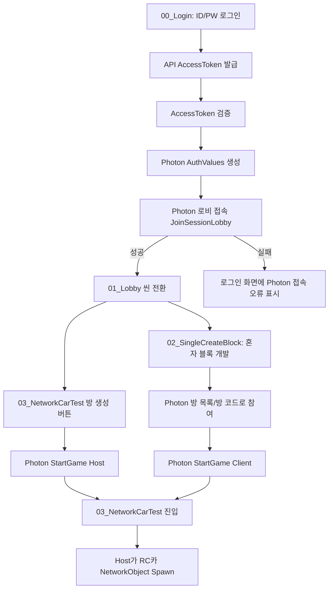

# Photon Fusion 2 네트워크 전환 계획

작성일: 2026-04-20  
개정일: 2026-04-21  
개정 이유: DB 기반 방 생성/방 참여 흐름을 Photon Fusion 2 기반 방 생성/방 참여 흐름으로 변경한다.

## 최종 결론

새 개발 방향은 다음과 같이 잡는다.

1. 로그인은 기존 API를 사용한다.
2. 로그인 성공 후 `AccessToken`을 받아온다.
3. `AccessToken` 검증이 끝나면 Photon Fusion 2에 먼저 접속한다.
4. Photon 접속이 성공한 경우에만 `01_Lobby` 씬으로 전환한다.
5. 로비 이후의 방 생성, 방 목록, 방 참여는 DB API를 사용하지 않고 Photon Fusion 세션 기능으로 처리한다.
6. `02_SingleCreateBlock`은 혼자 블록 코드를 개발하는 씬으로 유지하되, 방 참여 기능은 DB 방 참여가 아니라 Photon 방 참여로 바꾼다.
7. `03_NetworkCarTest`의 방 생성 기능은 DB 방 생성 API가 아니라 Photon 세션 생성으로 바꾼다.

중요한 변경점은 기존 계획의 "DB에서 방을 만들고 Photon은 그 roomId 세션에 붙는다"가 더 이상 최종 방향이 아니라는 점이다. 이제 방의 생성/목록/참여 권한의 1차 기준은 Photon 세션이다. DB는 로그인, 사용자 인증, 필요 시 블록 코드 저장 같은 서비스 데이터에만 사용한다.

## 용어 정리

이 문서에서 "Photon 접속"은 두 단계로 나눈다.

- Photon 로비 접속
  - 로그인 직후 수행한다.
  - `NetworkRunner.JoinSessionLobby(SessionLobby.ClientServer)`를 사용한다.
  - 방 목록을 `OnSessionListUpdated` 콜백으로 받는다.
  - 이 단계가 성공해야 `01_Lobby`로 이동한다.
- Photon 게임 세션 접속
  - 실제 방 생성 또는 방 참여 시 수행한다.
  - `NetworkRunner.StartGame()`을 사용한다.
  - Host는 `GameMode.Host`, 참여자는 `GameMode.Client`를 사용한다.

즉, 로그인 직후에는 아직 게임 방에 들어가는 것이 아니라 Photon 로비에 인증된 상태로 들어간다. 로비 씬에서 방을 만들거나 선택하면 그때 Fusion 게임 세션을 시작한다.

## 새 전체 흐름



## 책임 분리

### 기존 API가 계속 담당하는 것

- ID/PW 로그인
- `AccessToken` 발급
- `AccessToken` 검증
- refresh token 처리
- 사용자 프로필 또는 표시 이름 조회
- 필요 시 블록 코드 저장/불러오기

### Photon Fusion이 새로 담당하는 것

- 로그인 후 Photon 로비 접속
- 방 목록 제공
- 방 생성
- 방 참여
- 방 공개/비공개 상태
- 최대 인원
- 현재 인원
- Host/Client 접속 상태
- RC카 `NetworkObject` 생성
- RC카 위치/회전/상태 동기화
- 플레이어별 차량 매핑

### 더 이상 DB가 담당하지 않는 것

- 방 생성
- 방 목록
- 방 참여 요청
- 방 참여 승인/거절
- DB `roomId`를 기준으로 한 네트워크 방 입장

기존 `ChatRoomManager`의 방 생성/방 참여 API는 새 네트워크 흐름에서 제거하거나 비활성화한다. 단, 블록 코드 저장 API가 실제로 필요하면 별도 이름의 저장 서비스로 분리해서 유지할 수 있다.

## Photon Custom Authentication 정책

운영용 구조에서는 Photon Custom Authentication을 반드시 사용하는 것이 좋다.

현재 Unity 클라이언트는 로그인 후 받은 `AccessToken`을 Photon 인증값으로 넘긴다. Photon Dashboard에 Custom Authentication Provider가 설정되어 있으면 Photon 서버가 백엔드 토큰 검증 URL을 호출하고, 성공한 사용자만 Photon 로비와 세션에 들어갈 수 있다.

최근 확인한 오류:

```text
Authentication type not supported (none configured)
CustomAuthenticationFailed
```

이 오류는 코드가 Photon에 `AuthType = Custom`으로 접속했지만 Photon Dashboard에 Custom Authentication Provider가 설정되어 있지 않아서 발생한다. 새 흐름에서는 로그인 직후 Photon 접속이 필수이므로 이 설정을 먼저 해결해야 한다.

개발 단계 선택지는 두 가지다.

| 방식 | 용도 | 장점 | 단점 |
| --- | --- | --- | --- |
| Custom Auth | 운영/최종 구조 | AccessToken을 Photon 접속 단계에서도 검증 가능 | Photon Dashboard와 백엔드 인증 URL 설정 필요 |
| UserId Only 개발 모드 | 임시 개발 | 바로 Photon 로비/방 테스트 가능 | 토큰 검증이 약하므로 운영 사용 금지 |

권장 구현은 `FusionAuthFactory`에 인증 모드를 추가하는 것이다.

```csharp
public enum FusionAuthMode
{
    CustomAuth,
    UserIdOnly
}
```

개발 중에는 Inspector에서 `UserIdOnly`로 Photon 연결과 방 생성/참여를 먼저 검증할 수 있다. 운영 전에는 반드시 `CustomAuth`로 되돌리고 Photon Dashboard Custom Auth 설정을 완료해야 한다.

## Photon 세션 데이터 설계

DB 방 테이블 대신 Photon 세션이 방 데이터의 기준이 된다.

### SessionName

`SessionName`은 Photon 방의 고유 식별자다.

권장:

- 자동 생성 방: `rc-{shortGuid}` 또는 `rc-{timestamp}-{random}`
- 방 코드 입장: 사용자가 입력 가능한 짧은 코드 사용 가능
- DB `roomId`는 더 이상 사용하지 않는다.

### SessionProperties

Photon 방 목록에 표시하거나 필터링할 값은 `SessionProperties`에 넣는다.

권장 키:

| 키 | 타입 | 설명 |
| --- | --- | --- |
| `roomName` | string | 사용자에게 보이는 방 이름 |
| `hostUserId` | string | 방 생성자 userId |
| `hostName` | string | 방 생성자 표시 이름 |
| `mode` | string | `NetworkCar`, `Practice`, `Class` 등 |
| `createdAt` | string 또는 long | 생성 시간 |
| `isPracticeAllowed` | bool/int | `02_SingleCreateBlock` 사용자가 참여 가능한지 |

주의:

- Session Properties는 방 검색/표시용이다.
- RC카 위치, 실행 상태, 블록 실행 결과 같은 실시간 데이터는 `NetworkObject`, `Networked` property, RPC로 동기화한다.

### PlayerCount

`StartGameArgs.PlayerCount`는 방 최대 인원이다.

방장이 교사/호스트이고 학생 N명이 참여한다면, 호스트 포함 여부를 명확히 정해야 한다. Fusion의 PlayerCount는 세션 전체 인원 제한으로 보는 것이 안전하므로 호스트를 포함한 총 인원으로 설정한다.

현재 인원은 직접 계산하지 말고 Photon `SessionInfo.PlayerCount`를 기준으로 표시한다.

주의할 점:

- Host가 `StartGame(GameMode.Host)`에 성공하면 Photon 세션에는 Host 1명이 들어간 상태가 된다.
- Client가 `StartGame(GameMode.Client)`에 성공하면 해당 세션의 `PlayerCount`가 증가한다.
- 로비에 남아 있는 다른 클라이언트는 `OnSessionListUpdated`로 갱신된 `SessionInfo.PlayerCount`를 받는다.
- Host 또는 이미 게임 세션에 들어간 Client는 로비 목록 콜백이 아니라 `runner.SessionInfo.PlayerCount`와 `OnPlayerJoined`, `OnPlayerLeft`로 현재 방 인원을 갱신한다.
- UI에서 별도 `playerCount` SessionProperty를 만들어 관리하면 실제 Photon 인원과 어긋날 수 있으므로 1차 구현에서는 사용하지 않는다.

## Photon 입장 수락/거절 설계

기존 DB 방식의 입장 요청/승인/거절은 Photon에서도 구현할 수 있다. 다만 방식이 다르다.

DB 방식:

1. Client가 DB API로 입장 요청을 보낸다.
2. Host가 DB API로 요청 목록을 polling한다.
3. Host가 승인/거절 API를 호출한다.
4. Client가 승인 상태를 polling한 뒤 방에 들어간다.

Photon 방식:

1. Client가 Photon 세션에 들어가려고 `StartGame(GameMode.Client)`를 호출한다.
2. Client는 `StartGameArgs.ConnectionToken`에 `userId`, `displayName`, `sessionName`을 넣어 Host에게 보낸다.
3. Host의 `INetworkRunnerCallbacks.OnConnectRequest(...)`가 호출된다.
4. Host가 즉시 허용하려면 `request.Accept()`를 호출한다.
5. Host가 즉시 거절하려면 `request.Refuse()`를 호출한다.
6. Host가 수동으로 결정하려면 `request.Waiting()`으로 보류하고 UI에 요청을 띄운다.
7. Host가 UI에서 Accept를 누르면 저장해 둔 요청에 `Accept()`를 호출한다.
8. Host가 UI에서 Reject를 누르거나 제한 시간이 지나면 `Refuse()`를 호출한다.

권장 코드 구조:

```text
FusionConnectionManager
  - FusionJoinApprovalMode AutoAccept / Manual / AutoReject
  - OnConnectRequest에서 ConnectionToken 해석
  - Manual 모드면 pending request 목록에 저장
  - ApproveJoinRequest(requestId)
  - RejectJoinRequest(requestId)

FusionJoinRequestMonitorGUI
  - Host 화면에서 pending request 목록 표시
  - Accept / Reject 버튼 제공
```

수락/거절 기준:

- 개발 중: Host가 GUI에서 직접 Accept / Reject
- 운영 권장: Photon Custom Auth에서 access token 검증 + Host 수동 승인
- 추후 확장: 방 비밀번호, 초대 코드, 교사 전용 whitelist, 수업 참가자 명단 등을 ConnectionToken 또는 backend 검증과 결합

제한 사항:

- `OnConnectRequest`는 Host가 실행 중이어야 받을 수 있다.
- Host가 응답하지 않으면 Client는 접속 대기 상태가 되므로 timeout이 필요하다.
- 거절된 Client는 `StartGameResult.Ok == false` 또는 `ShutdownReason.ConnectionRefused` 계열로 실패 처리된다.
- Photon 로비의 방 목록에는 "요청 대기 중" 인원은 포함되지 않는다. 실제 수락되어 세션에 들어온 사용자만 `PlayerCount`에 반영된다.

## 씬별 새 흐름

### 00_Login

현재는 로그인 성공 후 바로 `01_Lobby`로 이동한다. 새 흐름에서는 이 순서를 바꾼다.

새 순서:

1. ID/PW 로그인 API 호출
2. `AccessToken` 수신
3. `AccessToken` 검증 API 호출
4. `AuthManager.CurrentUser`와 token 저장
5. `FusionAuthFactory`로 Photon 인증값 생성
6. `NetworkRunner.JoinSessionLobby(SessionLobby.ClientServer)` 호출
7. Photon 로비 접속 성공 확인
8. `01_Lobby` 씬 이동

실패 처리:

- API 로그인 실패: 기존 로그인 오류 표시
- AccessToken 검증 실패: 기존 로그인 오류 표시
- Photon Custom Auth 실패: Photon 인증 설정 또는 token 문제로 표시
- Photon 로비 접속 실패: 네트워크/Photon AppId/Region/Auth 문제로 표시

이 단계가 끝나기 전에는 `01_Lobby`로 보내지 않는다.

### 01_Lobby

로비 씬은 Photon 방 목록을 보여주는 화면이 된다.

기존 DB 기반:

- `ChatRoomManager.ListRooms()`
- `ChatRoomManager.CreateRoom()`
- `ChatRoomManager.RequestJoinRequest()`
- `ChatRoomManager.DecideJoinRequest()`

새 Photon 기반:

- `OnSessionListUpdated`로 받은 `SessionInfo` 목록 표시
- 방 생성 버튼은 `StartGame(GameMode.Host)` 호출
- 방 참여 버튼은 `StartGame(GameMode.Client)` 호출
- Client는 `EnableClientSessionCreation = false`로 설정

로비에서 필요한 UI:

- Photon 접속 상태
- 새로고침 또는 자동 갱신된 Photon 세션 목록
- 방 이름
- 현재 인원/최대 인원
- Host 이름
- 방 생성 버튼
- 선택한 방 참여 버튼
- 방 코드 직접 입력 참여 기능

### 02_SingleCreateBlock

이 씬은 혼자 블록 코드를 작성하고 테스트하는 용도로 유지한다.

중요 변경:

- 여기서 DB 방 참여 기능을 사용하지 않는다.
- 방 참여가 필요하면 Photon 방 목록 또는 방 코드 입력으로 참여한다.
- 참여 성공 후 `03_NetworkCarTest`로 이동한다.

권장 흐름:

1. 사용자가 `02_SingleCreateBlock`에서 혼자 블록 코드 작성
2. 저장 버튼은 로컬 임시 저장 또는 기존 블록 코드 저장 API 사용 가능
3. 방 참여 버튼 클릭
4. Photon 세션 목록 표시 또는 방 코드 입력
5. 선택한 Photon 세션에 `GameMode.Client`로 참여
6. 참여 성공 시 `03_NetworkCarTest`로 전환
7. 작성한 블록 코드는 Host에게 RPC로 전달하거나, 기존 저장 API의 block id만 전달한다.

여기서 중요한 점은 "방 참여"가 DB join request가 아니라 Photon `StartGame(GameMode.Client)`라는 것이다.

### 03_NetworkCarTest

이 씬은 실제 네트워크 RC카 실행 씬이다.

방 생성 버튼 동작:

- 기존 DB 방 생성 API 호출 금지
- Photon `StartGame(GameMode.Host)`로 방 생성
- `SessionName`, `PlayerCount`, `SessionProperties`, `IsOpen`, `IsVisible` 설정

방 참여자 동작:

- Photon `StartGame(GameMode.Client)`로 기존 세션 참여
- `EnableClientSessionCreation = false`
- 참여 실패 시 로비 또는 방 목록으로 복귀

RC카 생성:

- Host만 RC카를 생성한다.
- Unity `Instantiate` 대신 `Runner.Spawn()`을 사용한다.
- Client는 Spawn된 `NetworkObject`를 동기화로 본다.

## 구현 대상 파일 설계

### 새로 추가할 네트워크 계층

권장 위치:

```text
Assets/Scripts/Network/Fusion/
  FusionAuthFactory.cs
  FusionConnectionManager.cs
  FusionLobbyService.cs
  FusionRoomService.cs
  FusionRoomInfo.cs
  FusionRoomSessionContext.cs
  FusionNetworkBootstrap.cs
```

### FusionConnectionManager

역할:

- 로그인 후 Photon 로비 연결 담당
- `NetworkRunner` 생성/보관
- `JoinSessionLobby(SessionLobby.ClientServer)` 호출
- Photon 연결 상태 제공
- 연결 성공 후 로비 씬 전환 가능 신호 제공
- 로그아웃 시 Photon 연결 종료

필요 상태:

```csharp
public bool IsPhotonConnected { get; }
public bool IsInSessionLobby { get; }
public NetworkRunner Runner { get; }
public string LastError { get; }
```

완료 기준:

- 로그인 성공 후 Photon 로비 접속이 성공해야 `01_Lobby`로 이동한다.
- Photon Custom Auth 실패 시 로비로 이동하지 않는다.
- `OnSessionListUpdated`를 받을 준비가 되어 있어야 한다.

### FusionLobbyService

역할:

- Photon 세션 목록 관리
- `OnSessionListUpdated` 콜백을 UI에 전달
- `SessionInfo`를 UI 표시용 `FusionRoomInfo`로 변환
- 방 필터링, 정렬, 새로고침 상태 관리

완료 기준:

- DB 방 목록 API 없이 Photon 방 목록이 보인다.
- 빈 목록이면 "현재 생성된 Photon 방 없음" 상태를 표시한다.

### FusionRoomService

역할:

- Photon 방 생성
- Photon 방 참여
- Photon 방 나가기
- Host/Client GameMode 결정
- `StartGameArgs` 구성

방 생성 예시 방향:

```csharp
await runner.StartGame(new StartGameArgs
{
    GameMode = GameMode.Host,
    SessionName = generatedSessionName,
    PlayerCount = maxPlayers,
    IsOpen = true,
    IsVisible = true,
    SessionProperties = properties,
    AuthValues = authValues,
    SceneManager = sceneManager
});
```

방 참여 예시 방향:

```csharp
await runner.StartGame(new StartGameArgs
{
    GameMode = GameMode.Client,
    SessionName = selectedSessionName,
    EnableClientSessionCreation = false,
    AuthValues = authValues,
    SceneManager = sceneManager
});
```

완료 기준:

- Host가 Photon 방을 만들 수 있다.
- Client가 Photon 방 목록에서 선택한 방에 들어갈 수 있다.
- Client가 틀린 방 이름으로 접속할 때 새 방이 생성되지 않는다.

### FusionRoomSessionContext

기존 `RoomSessionContext`는 DB `RoomInfo`에 의존한다. 새 흐름에서는 Photon 세션 정보를 보관하는 별도 컨텍스트가 필요하다.

권장 저장값:

```csharp
public sealed class FusionRoomSessionContext
{
    public string SessionName { get; }
    public string RoomName { get; }
    public string HostUserId { get; }
    public GameMode GameMode { get; }
    public bool IsHost { get; }
}
```

완료 기준:

- `03_NetworkCarTest`는 DB `RoomInfo` 없이 현재 Photon 세션 정보를 알 수 있다.
- Host/Client 판단을 DB `HostUserId`가 아니라 Fusion Runner 상태와 Photon session property 기준으로 한다.

## 기존 구현에서 바꿔야 할 부분

### AuthManager

현재:

- 로그인 성공 후 `01_Lobby`로 바로 이동

변경:

- 로그인 성공 후 `FusionConnectionManager.ConnectToPhotonLobbyAsync()` 호출
- Photon 로비 접속 성공 시에만 `01_Lobby` 이동
- 실패 시 로그인 화면에 오류 표시

### FusionAuthFactory

현재:

- `AccessToken`을 Photon Custom Auth payload로 만든다.

변경:

- 운영용 `CustomAuth`
- 개발용 `UserIdOnly`
- `roomId` 대신 필요하면 `sessionName`을 optional payload로 전달

중요:

- Custom Auth를 켜면 Photon Dashboard 설정이 필수다.
- Dashboard 설정 전에는 개발용 `UserIdOnly` 모드로만 Photon 연결 테스트가 가능하다.

### FusionNetworkBootstrap

현재 구현 방향:

- `RoomSessionContext.CurrentRoom`에서 DB roomId와 hostUserId를 읽어서 Host/Client를 자동 결정

변경 필요:

- DB `RoomSessionContext` 의존 제거
- Photon 방 생성/참여는 `FusionRoomService`가 담당
- `03_NetworkCarTest`에서는 이미 시작된 Runner를 사용하거나, `FusionRoomSessionContext`의 세션 정보를 사용해 연결을 이어간다.

즉, 기존 `FusionNetworkBootstrap`은 "DB 방 컨텍스트 기반 자동 접속"에서 "Photon 세션 컨텍스트 기반 네트워크 씬 초기화" 역할로 바뀌어야 한다.

### LobbyUIController

현재:

- 방 생성 버튼이 `ChatRoomManager.CreateRoom()` 또는 기존 room flow를 호출
- 성공 후 `RoomSessionContext.Set()` 후 `03_NetworkCarTest` 이동

변경:

- 방 생성 버튼이 `FusionRoomService.CreateRoomAsync()` 호출
- 성공 후 `FusionRoomSessionContext.Set()` 또는 Runner 상태 저장
- `03_NetworkCarTest` 이동

### But_RoomList

현재:

- DB 방 목록을 표시
- 선택한 DB 방에 join request를 보내거나 바로 `RoomSessionContext.Set()`

변경:

- Photon `SessionInfo` 목록 표시
- 선택한 Photon 세션에 `FusionRoomService.JoinRoomAsync()` 호출
- DB join request, approval polling 제거

### ChatRoomManager

새 네트워크 방 흐름에서는 다음 기능을 더 이상 사용하지 않는다.

- `CreateRoom`
- `RequestJoinRequest`
- `FetchJoinRequests`
- `DecideJoinRequest`
- `FetchMyJoinRequestStatus`
- DB room list fetch

유지할 수 있는 기능:

- 블록 코드 저장/불러오기 API가 필요하다면 별도 서비스로 분리
- 예: `BlockCodeStorageService`, `BlockShareService`

중요: `ChatRoomManager`라는 이름으로 방과 블록 저장을 계속 섞어두면 새 Photon 흐름에서 혼동이 커진다. 방 관련 코드는 Photon으로 옮기고, 저장 관련 코드만 별도 클래스로 분리하는 것이 좋다.

### HostJoinRequestMonitorUI / HostJoinRequestMonitorGUI

현재:

- DB 입장 요청 목록을 보고 승인/거절

변경:

- DB polling 기반 UI는 제거하거나 비활성화한다.
- Photon 수동 승인 UI는 `FusionJoinRequestMonitorGUI` 또는 별도 UGUI 패널로 대체한다.
- Photon 수동 승인 UI는 `FusionConnectionManager.PendingJoinRequests`를 표시하고 `ApproveJoinRequest`, `RejectJoinRequest`를 호출한다.
- Host가 아닌 Client 화면에서는 표시하지 않는다.

### HostNetworkCarCoordinator

현재:

- DB 입장 승인 이벤트와 블록 공유 이벤트를 기준으로 사용자 슬롯/차량 생성 흐름을 구성

변경:

- Fusion `OnPlayerJoined`를 기준으로 플레이어 등록
- `PlayerRef`, `runner.UserId`, custom auth user id를 기준으로 사용자 매핑
- Host만 슬롯을 부여하고 `Runner.Spawn()`으로 RC카 생성

## 방 생성 세부 흐름

### 로비에서 03_NetworkCarTest 방 생성 버튼 클릭

1. 사용자가 로비에서 방 이름과 최대 인원을 입력한다.
2. `FusionRoomService.CreateRoomAsync()` 호출
3. `SessionName` 자동 생성
4. `SessionProperties` 구성
5. `StartGame(GameMode.Host)` 호출
6. 성공하면 `FusionRoomSessionContext` 저장
7. `03_NetworkCarTest` 씬 이동
8. Host Runner가 유지되고, Host 권한으로 RC카 Spawn 준비

실패 시:

- Photon 접속이 끊겼으면 로그인 또는 재접속 UI로 이동
- 방 생성 실패 사유 표시
- 사용한 Runner가 shutdown 상태면 새 Runner 생성 후 재시도

## 방 참여 세부 흐름

### 로비에서 방 참여

1. `FusionLobbyService`가 Photon 세션 목록을 UI에 표시한다.
2. 사용자가 방을 선택한다.
3. `FusionRoomService.JoinRoomAsync(sessionName)` 호출
4. `StartGame(GameMode.Client)` 호출
5. `EnableClientSessionCreation = false`
6. 성공하면 `FusionRoomSessionContext` 저장
7. `03_NetworkCarTest` 씬 이동

### 02_SingleCreateBlock에서 방 참여

1. 사용자가 혼자 블록 코드를 만든다.
2. 방 참여 버튼 클릭
3. Photon 방 목록 또는 방 코드 입력 UI 표시
4. `FusionRoomService.JoinRoomAsync(sessionName)` 호출
5. 성공하면 `03_NetworkCarTest` 씬 이동
6. 작성 중인 블록 코드는 다음 중 하나로 전달한다.
   - 즉시 RPC로 Host에게 전달
   - 로컬 임시 저장 후 네트워크 씬에서 업로드
   - 기존 블록 코드 저장 API에 저장 후 저장 ID만 Host에게 전달

DB 방 참여 요청은 이 흐름에서 완전히 제거한다.

## RC카 생성 세부 흐름

1. Host가 Photon 방을 만든다.
2. Client가 Photon 방에 들어온다.
3. Host의 `OnPlayerJoined`에서 `PlayerRef`를 확인한다.
4. Host가 플레이어 슬롯을 할당한다.
5. Host가 `Runner.Spawn()`으로 해당 플레이어의 RC카 `NetworkObject`를 생성한다.
6. Spawn 시 `inputAuthority`를 참여자 `PlayerRef`로 줄지, Host 권위 방식으로 둘지 결정한다.
7. Client는 Spawn된 RC카를 화면에서 본다.
8. 블록 실행은 1차 구현에서는 Host 권위로 처리한다.

권장 1차 권한 모델:

- Host가 모든 RC카의 실제 실행과 물리 결과를 관리한다.
- Client는 자신의 블록 코드 또는 실행 요청만 보낸다.
- Host가 결과를 NetworkObject로 동기화한다.

이 방식이 기존 `HostNetworkCarCoordinator`, `HostExecutionScheduler` 구조와 가장 잘 맞는다.

## 구현 단계

### 0단계: Photon Dashboard와 인증 정책 정리

작업:

- Photon Fusion AppId 확인
- Region 설정 확인
- Custom Authentication Provider 설정 여부 결정
- Custom Auth를 쓸 경우 백엔드 token 검증 URL 준비
- 개발 중 우회를 위해 `UserIdOnly` 모드 추가 여부 결정

완료 기준:

- 로그인 후 Photon 로비 접속이 실패하지 않는다.
- `Authentication type not supported (none configured)` 오류가 사라진다.

### 1단계: 로그인 후 Photon 로비 접속

추가/수정:

- `FusionConnectionManager`
- `FusionAuthFactory` 인증 모드
- `AuthManager` 로그인 성공 후 씬 전환 순서

완료 기준:

- 로그인 성공
- AccessToken 검증 성공
- Photon 로비 접속 성공
- 그 후 `01_Lobby` 이동

### 2단계: Photon 방 목록 UI

추가/수정:

- `FusionLobbyService`
- Photon `OnSessionListUpdated` UI 연결
- 기존 DB 방 목록 UI 대체

완료 기준:

- DB 방 목록 API 호출 없이 Photon 방 목록이 표시된다.
- 방이 없으면 빈 상태가 표시된다.

### 3단계: Photon 방 생성

추가/수정:

- `FusionRoomService.CreateRoomAsync`
- `LobbyUIController` 방 생성 버튼 연결
- `03_NetworkCarTest` 방 생성 버튼 연결
- DB `CreateRoom` 호출 제거

완료 기준:

- 로비에서 Photon 방 생성 성공
- 생성된 방이 다른 클라이언트의 Photon 방 목록에 보인다.
- 생성 성공 후 Host가 `03_NetworkCarTest`에 들어간다.

### 4단계: Photon 방 참여

추가/수정:

- `FusionRoomService.JoinRoomAsync`
- `But_RoomList` Photon 세션 목록 기반으로 변경
- `02_SingleCreateBlock` 방 참여 버튼 변경
- DB join request/approval polling 제거
- Client `StartGameArgs.ConnectionToken`에 userId/displayName/sessionName 포함

완료 기준:

- Client가 Photon 방 목록에서 방을 선택해 참여한다.
- 틀린 방 코드로 들어갈 때 새 방이 만들어지지 않는다.
- 참여 성공 후 `03_NetworkCarTest`에 들어간다.
- Host 수동 승인 모드에서는 Host가 Accept하기 전까지 Client가 방에 들어가지 않는다.

### 4.5단계: Photon 입장 수락/거절

추가/수정:

- `FusionConnectionManager`에 `FusionJoinApprovalMode` 추가
- `OnConnectRequest`에서 `AutoAccept`, `Manual`, `AutoReject` 분기
- Manual 모드에서는 `request.Waiting()` 호출 후 pending request 저장
- `FusionJoinRequestMonitorGUI` 또는 UGUI 패널에서 Accept/Reject 처리
- 일정 시간 동안 응답하지 않은 요청은 자동 Refuse

완료 기준:

- Host 화면에 Photon 입장 요청이 표시된다.
- Host가 Accept하면 Client 접속이 완료되고 PlayerCount가 증가한다.
- Host가 Reject하면 Client 접속이 실패하고 PlayerCount가 증가하지 않는다.
- timeout된 요청은 자동 거절된다.

### 5단계: 03_NetworkCarTest 네트워크 씬 정리

추가/수정:

- `FusionNetworkBootstrap`의 DB `RoomSessionContext` 의존 제거
- 이미 시작된 Runner 또는 Photon 세션 컨텍스트 사용
- 네트워크 씬에서 Host/Client 상태 표시

완료 기준:

- Host와 Client가 같은 Photon SessionName에 있다.
- `Runner.SessionInfo.Name`이 양쪽에서 동일하다.
- Host는 `IsServer == true`, Client는 `IsClient == true` 상태다.

### 6단계: RC카 NetworkObject Spawn

추가/수정:

- RC카 prefab에 `NetworkObject` 추가
- transform 동기화 컴포넌트 추가
- `NetworkRCCar` 추가
- `NetworkRCCarSpawner` 추가
- `HostCarSpawner`의 로컬 Instantiate를 Fusion Spawn으로 대체

완료 기준:

- Host가 Spawn한 RC카가 Client 화면에 보인다.
- 위치/회전이 동기화된다.

### 7단계: DB 방 코드 제거 및 정리

작업:

- DB 방 생성 API 호출 제거
- DB 방 목록 API 호출 제거
- DB 방 참여 요청 API 호출 제거
- DB 방 승인/거절 UI 제거 또는 비활성화
- `RoomSessionContext`를 Photon용 컨텍스트로 대체
- 방 관련 클래스 이름에서 ChatRoom/DB 의미 제거

완료 기준:

- 방 생성/방 참여 경로에서 `ChatRoomManager`의 room API가 호출되지 않는다.
- Photon 없이 DB만으로 방에 들어가는 경로가 남아 있지 않다.

## 확인 방법

### 로그인 직후 Photon 연결 확인

Unity Console에서 확인할 로그:

```text
Photon lobby connect started
Photon lobby connected
OnSessionListUpdated
LoadScene: 01_Lobby
```

확인할 값:

- `AuthManager.IsAuthenticated == true`
- `AuthManager.CurrentUser.userId` 존재
- `FusionConnectionManager.IsPhotonConnected == true`
- `FusionConnectionManager.IsInSessionLobby == true`

### 방 생성 확인

Host에서 확인:

- `StartGameResult.Ok == true`
- `Runner.IsRunning == true`
- `Runner.IsServer == true`
- `Runner.SessionInfo.IsValid == true`
- `Runner.SessionInfo.Name` 존재

Client 로비에서 확인:

- `OnSessionListUpdated`에 Host가 만든 세션이 표시된다.

### 방 참여 확인

Client에서 확인:

- `StartGameResult.Ok == true`
- `Runner.IsClient == true`
- `Runner.SessionInfo.Name == 선택한 SessionName`
- 틀린 SessionName 입력 시 실패하고 새 방이 생성되지 않는다.

### DB 방 API 제거 확인

Console 또는 breakpoint로 확인:

- 방 생성 시 `ChatRoomManager.CreateRoom()` 호출 없음
- 방 참여 시 `RequestJoinRequest()` 호출 없음
- 입장 승인 polling 없음
- 방 목록 갱신 시 DB list rooms 호출 없음

## 마이그레이션 우선순위

가장 빠른 성공 경로:

1. Photon Custom Auth 설정 또는 개발용 `UserIdOnly` 모드 추가
2. 로그인 후 Photon 로비 접속 성공시키기
3. `01_Lobby`에서 Photon 세션 목록 표시
4. Photon 방 생성 구현
5. Photon 방 참여 구현
6. `02_SingleCreateBlock`의 방 참여를 Photon으로 변경
7. `03_NetworkCarTest`의 DB 방 생성 경로 제거
8. RC카 prefab을 NetworkObject로 전환
9. Host가 `Runner.Spawn()`으로 RC카 생성
10. 기존 DB 방 관련 코드 제거

## 최종 상태

최종적으로 프로젝트는 다음 구조가 되어야 한다.

- 로그인과 사용자 신원은 기존 API가 담당한다.
- 로그인 성공 후 Photon에 인증된 상태로 접속한다.
- Photon 접속 성공 후에만 로비로 이동한다.
- 로비의 방 목록은 Photon 세션 목록이다.
- 방 생성은 Photon `StartGame(GameMode.Host)`다.
- 방 참여는 Photon `StartGame(GameMode.Client)`다.
- DB 방 생성/방 참여/입장 승인 흐름은 사용하지 않는다.
- `02_SingleCreateBlock`은 혼자 개발 후 Photon 방에 참여하는 흐름을 제공한다.
- `03_NetworkCarTest`는 Photon 세션 안에서 RC카 NetworkObject를 생성하고 동기화한다.

## 2026-04-21 실행 로그 분석

### 현재 막히는 핵심 원인

가장 먼저 해결해야 하는 오류는 다음 로그다.

```text
[NetworkRCCarSpawner] carPrefab does not contain NetworkObject. prefab=Car
```

이 로그는 단순 경고처럼 보이지만, 현재 흐름에서는 차량 생성 실패의 직접 원인이다.

확인한 호출 흐름:

1. `HostNetworkCarCoordinator.SyncFusionParticipants()`
2. `HostNetworkCarCoordinator.EnsureParticipantForPlayer()`
3. `HostNetworkCarCoordinator.EnsureParticipantSlotAndCar()`
4. `HostCarSpawner.EnsureCarForSlot()`
5. `NetworkRCCarSpawner.SpawnForPlayer()`
6. `carPrefab.GetComponent<NetworkObject>() == null` 이라서 `Runner.Spawn()` 호출 전에 중단

즉, Host가 플레이어 슬롯을 만들려고는 하지만, `_carPrefab`으로 지정된 `Car` 프리팹 루트에 Fusion `NetworkObject`가 없어서 네트워크 차량이 생성되지 않는다.

### 확인된 프리팹 상태

`03_NetworkCarTest` 씬의 `HostNetworkCarCoordinator._carPrefab`은 다음 프리팹을 참조한다.

```text
Assets/Resources/Prefabs/Car.prefab
```

현재 `Car.prefab` 루트에는 Rigidbody, 센서, 모터, 실행기, 물리 관련 컴포넌트는 있지만 Fusion `NetworkObject`와 `NetworkRCCar`가 붙어 있지 않은 상태로 보인다.

`NetworkRCCar` 스크립트에는 이미 다음 요구사항이 정의되어 있다.

```csharp
[RequireComponent(typeof(NetworkObject))]
public sealed class NetworkRCCar : NetworkBehaviour
```

따라서 이 프리팹은 일반 RC카 프리팹으로는 동작할 수 있지만, Fusion 네트워크 스폰용 프리팹으로는 아직 준비되지 않았다.

### 해결 방향

코드 수정 없이 먼저 확인할 항목:

1. Unity Editor에서 `Assets/Resources/Prefabs/Car.prefab`을 연다.
2. 루트 오브젝트 `Car`에 Fusion `NetworkObject` 컴포넌트가 있는지 확인한다.
3. 루트 오브젝트 `Car`에 `NetworkRCCar` 컴포넌트가 있는지 확인한다.
4. 두 컴포넌트가 없으면 `Tools/RC/Fusion/Setup Network Car Prefab` 메뉴를 실행한다.
5. 실행 후 Fusion Network Project Config의 prefab table이 갱신되었는지 확인한다.
6. 다시 Host/Client 실행 후 `NetworkRCCarSpawner`에서 `Spawned network car` 로그가 나오는지 확인한다.

프로젝트에는 이미 `Assets/Scripts/Network/Fusion/Editor/FusionNetworkCarPrefabSetup.cs`가 있고, 이 메뉴는 `Car.prefab`에 `NetworkObject`, `NetworkRCCar`를 붙인 뒤 prefab table을 다시 빌드하도록 만들어져 있다. 따라서 현재 상태에서는 새 코드를 작성하기보다 이 에디터 메뉴를 먼저 실행하는 것이 맞다.

### 입장 요청 로그가 여러 개 쌓이는 문제

다음 로그도 같이 보인다.

```text
Join request waiting for host decision...
Pending Photon join requests updated. count=1
Pending Photon join requests updated. count=2
Pending Photon join requests updated. count=3
```

이것은 차량 생성 실패의 직접 원인은 아니지만, 현재 수동 승인 흐름에 중복 요청이 쌓이고 있다는 신호다.

현재 `FusionConnectionManager.OnConnectRequest()`는 `FusionJoinApprovalMode.Manual` 상태에서 ConnectRequest가 들어올 때마다 새 `requestId`를 만든다. 같은 클라이언트가 재시도하거나 direct/relay 경로로 다시 ConnectRequest를 발생시키면, 기존 요청과 같은 사람인지 비교하지 않고 목록에 새 항목을 추가한다.

로그에서도 같은 원격 주소에서 여러 요청이 들어온 뒤, 하나를 승인해도 이전 요청들이 목록에 남아 있다.

```text
Pending Photon join requests updated. count=3
Join request accepted...
Pending Photon join requests updated. count=2
```

따라서 수동 승인 UI에서는 같은 사용자 또는 같은 remote/token 기반 요청을 중복 제거하는 정책이 필요하다. 다만 이것은 2순위 문제이고, 지금처럼 차량이 안 나오는 직접 원인은 `Car.prefab`의 `NetworkObject` 누락이다.

### token의 user/name이 비어 있는 문제

입장 요청 로그에 다음처럼 표시된다.

```text
user=, name=, tokenBytes=128
```

토큰 바이트는 있으므로 token 자체는 넘어오지만, `FusionConnectionTokenPayload.userId`와 `displayName`이 빈 값으로 만들어진 상태일 가능성이 높다. `FusionConnectionTokenUtility.CreateForCurrentUser()`는 `AuthManager.CurrentUser`에서 값을 읽기 때문에, 클라이언트가 Photon 방 참여를 시작하는 시점에 `AuthManager.CurrentUser.userId`가 비어 있으면 host 승인 UI에서도 사용자 정보가 비어 보인다.

다만 Fusion 로그에는 다음 매핑도 보인다.

```text
RegisterUniqueIdPlayerMapping actorid:2 ...
```

즉 Photon AuthValues 쪽 UserId 매핑은 별도로 성공했을 수 있다. UI 표시용 token payload가 비어 있는 문제와 Fusion 내부 UserId 매핑 문제는 분리해서 봐야 한다.

### HostBlockShareAutoRefreshPanel 로그

다음 로그는 차량 생성 실패의 직접 원인은 아니다.

```text
[HostBlockShareAutoRefreshPanel] Current user is not host.
```

이 패널은 host 전용 자동 갱신 UI인데, 현재 user가 host가 아니라고 판단되어 refresh를 건너뛴 것이다. Client 화면에서도 패널/폴링이 켜져 있으면 나올 수 있는 로그다. 기능적으로는 불필요한 소음에 가깝고, host 전용 UI가 client에서 활성화되지 않도록 정리하면 된다.

### 우선순위

1. `Car.prefab` 루트에 `NetworkObject`와 `NetworkRCCar`를 붙이고 Fusion prefab table을 갱신한다.
2. Host 실행 시 `NetworkRCCarSpawner`가 `Runner.Spawn()`까지 도달하는지 확인한다.
3. Client 입장 승인 후 `OnPlayerJoined`, `SyncFusionParticipants`, 차량 spawn 로그 순서가 정상인지 확인한다.
4. 같은 클라이언트의 수동 입장 요청이 여러 개 쌓이는 문제를 별도 이슈로 처리한다.
5. token payload의 `userId`, `displayName`이 빈 값으로 만들어지는 시점을 확인한다.
6. host 전용 block share refresh UI가 client에서 동작하지 않도록 정리한다.

### 결론

이번 로그에서 "안되는" 직접 원인은 Photon 접속 자체보다 RC카 프리팹 준비 상태다. Host는 참여자를 감지하고 차량을 만들려고 하지만, `_carPrefab`으로 지정된 `Car`가 Fusion `NetworkObject` 프리팹이 아니기 때문에 `Runner.Spawn()`을 실행하지 못한다.

## 2026-04-21 추가 로그 분석: NetworkObject 추가 이후

### 상태 변화

`Car` 프리팹에 `NetworkObject`와 `NetworkRCCar`를 추가한 뒤에는 이전의 핵심 오류가 더 이상 보이지 않는다.

이전 오류:

```text
[NetworkRCCarSpawner] carPrefab does not contain NetworkObject. prefab=Car
```

새 로그에는 이 오류가 없고, 대신 다음 로그가 먼저 보인다.

```text
[BlockCodeExecutor] Program source not found in memory. File fallback is disabled.
[VirtualCarPhysics] Initialized with VirtualMotorDriver and BlockCodeExecutor.
```

즉, 프리팹이 네트워크 오브젝트로 준비되지 않아 spawn 입구에서 막히던 문제는 한 단계 넘어간 것으로 봐야 한다. 현재는 차량 런타임 컴포넌트가 실제로 켜지면서, 블록 코드 JSON이 아직 로드되지 않은 문제가 드러난 상태다.

### BlockCodeExecutor 경고의 의미

`BlockCodeExecutor.Start()`는 시작 시점에 `LoadProgram()`을 호출한다.

`LoadProgram()`의 로드 순서는 다음과 같다.

1. `BE2_UI_ContextMenuManager.LatestRuntimeJson`에 메모리 JSON이 있는지 확인한다.
2. 메모리 JSON이 없으면 `allowFileFallbackWhenMemoryEmpty` 값을 확인한다.
3. 현재 `Car.prefab`의 `allowFileFallbackWhenMemoryEmpty`는 `false`다.
4. 따라서 로컬 파일 fallback 없이 바로 다음 경고를 출력하고 종료한다.

```text
[BlockCodeExecutor] Program source not found in memory. File fallback is disabled.
```

이 경고는 Photon 접속 실패나 차량 프리팹 실패를 의미하지 않는다. 현재 구조에서는 Host가 학생별 블록 코드 JSON을 나중에 `HostRuntimeBinder.TryApplyJson()` -> `BlockCodeExecutor.LoadProgramFromJson()` 경로로 주입한다. 따라서 차량이 생성되는 순간에는 아직 코드가 없을 수 있다.

다만 이 상태에서 차량 실행을 시작하면 `BlockCodeExecutor.IsLoaded == false`이므로 `VirtualCarPhysics.FixedUpdate()`에서 다음 경고가 반복될 수 있다.

```text
[Physics] BlockCodeExecutor not loaded!
```

결론적으로 이 경고는 "차량은 준비됐지만 실행할 블록 코드 JSON이 아직 들어오지 않았다"는 의미다.

### 정상 흐름에서 추가로 보여야 하는 로그

이 단계에서 정상 동작을 확인하려면 다음 로그가 이어서 나와야 한다.

```text
[NetworkRCCarSpawner] Spawned network car...
[HostCarSpawner] Spawned network car...
Code mapped. user=..., slot=..., shareId=...
[BlockCodeExecutor] Program loaded from save:...
```

현재 제공된 새 로그에는 `NetworkRCCarSpawner`의 spawn 성공 로그와 `Code mapped` 로그가 보이지 않는다. 따라서 `NetworkObject` 추가는 되었지만, 실제 player joined 이후 슬롯/차량 생성과 코드 매핑까지 완주했는지는 아직 로그만으로는 확정할 수 없다.

확인 기준:

1. 입장 승인 후 `Player joined` 로그가 나오는지 확인한다.
2. 그 직후 `NetworkRCCarSpawner` 또는 `HostCarSpawner`의 `Spawned network car` 로그가 나오는지 확인한다.
3. 학생이 블록 코드를 저장/공유한 뒤 `Code mapped` 로그가 나오는지 확인한다.
4. `Program loaded from save:` 또는 `Program loaded from slot=` 로그가 나오는지 확인한다.
5. 실행 버튼을 눌렀을 때 slot 상태가 `no-code`가 아니라 `running`으로 바뀌는지 확인한다.

### 반복되는 Join request 문제

새 로그에서도 같은 클라이언트로 보이는 요청이 계속 누적된다.

```text
Pending Photon join requests updated. count=1
Pending Photon join requests updated. count=2
Pending Photon join requests updated. count=3
...
Pending Photon join requests updated. count=6
```

특징:

- 처음에는 같은 LAN 주소와 포트로 여러 요청이 들어온다.
- 이후에는 같은 `ActorId: 2` relay 주소로 여러 요청이 다시 들어온다.
- `user=, name=`은 계속 비어 있다.
- Host가 pending 요청을 모두 승인하면 `Player:3`, `Player:4` 같은 추가 player mapping도 생긴다.

이 흐름은 현재 수동 승인 모드가 같은 클라이언트의 재시도 요청을 중복 제거하지 못하고 있음을 의미한다. `FusionConnectionManager.OnConnectRequest()`는 `Manual` 모드에서 요청이 들어올 때마다 새 `requestId`를 만들고 pending list에 추가한다. 같은 사용자/같은 remote/같은 token인지 비교해서 기존 요청을 갱신하거나 제거하는 로직은 없다.

주의할 점:

같은 클라이언트에서 쌓인 pending 요청을 전부 승인하면, 이미 유효하지 않은 이전 connection attempt까지 승인할 수 있고, 그 결과 player mapping이 여러 개 생긴 것처럼 보일 수 있다. 테스트할 때는 일단 가장 최근 요청 하나만 승인하고, 나머지는 timeout 또는 reject로 정리되는지 확인하는 편이 낫다.

### token의 user/name 빈 값은 아직 남아 있음

새 로그에서도 다음 값은 계속 비어 있다.

```text
user=, name=, tokenBytes=128
```

`tokenBytes=128`이므로 token byte array 자체는 전달된다. 그러나 token 내부의 `FusionConnectionTokenPayload.userId`, `displayName` 값이 비어 있는 상태다.

이 값은 `FusionConnectionTokenUtility.CreateForCurrentUser()`에서 `AuthManager.CurrentUser`를 읽어 만든다. 따라서 클라이언트가 `JoinRoomAsync()`를 호출하는 시점에 다음 값이 비어 있을 가능성이 있다.

```text
AuthManager.Instance.CurrentUser.userId
AuthManager.Instance.CurrentUser.name 또는 username
```

단, Photon 내부의 `RegisterUniqueIdPlayerMapping` 로그는 별도로 나오고 있으므로, Photon AuthValues의 UserId 매핑과 UI 표시용 connection token payload는 분리해서 봐야 한다. 지금 당장 방 입장 자체를 막는 1순위 원인은 아니지만, host 승인 UI에서 누가 요청했는지 알 수 없으므로 반드시 정리해야 한다.

### Photon runner shutdown 로그

마지막의 다음 로그는 오류로 보지 않는다.

```text
Photon runner shutdown. reason=Ok
NetworkRunner:OnApplicationQuit()
```

스택에 `OnApplicationQuit()`가 있으므로 Unity Play 종료 또는 애플리케이션 종료에 따른 정상 shutdown이다. 접속 실패로 인한 강제 종료 로그가 아니다.

### 현재 우선순위

1. `Car.prefab`에 `NetworkObject`, `NetworkRCCar`가 추가된 상태를 유지한다.
2. Fusion prefab table이 갱신됐는지 확인한다.
3. 입장 요청은 중복 pending을 모두 승인하지 말고, 최신 요청 하나만 승인해서 `Player joined`가 발생하는지 확인한다.
4. `Player joined` 이후 `NetworkRCCarSpawner`의 `Spawned network car` 로그가 나오는지 확인한다.
5. 학생 코드 저장/공유 이후 `Code mapped`와 `Program loaded from ...` 로그가 나오는지 확인한다.
6. 이후에도 join request가 계속 쌓이면 `FusionConnectionManager.OnConnectRequest()`에 중복 요청 정리 정책을 추가하는 것을 별도 작업으로 잡는다.
7. `user=, name=` 문제는 `JoinRoomAsync()` 호출 시점의 `AuthManager.CurrentUser` 값을 확인해서 token payload 생성 문제로 분리한다.

### 결론

이번 새 로그는 `NetworkObject` 추가 이후 문제가 바뀌었다는 신호다. 이전처럼 차량 프리팹이 네트워크 스폰 조건을 만족하지 못하는 문제는 해결된 것으로 보이며, 지금 남은 핵심은 다음 두 가지다.

1. 차량이 생성된 뒤 실행할 블록 코드 JSON이 아직 주입되지 않아 `BlockCodeExecutor`가 비어 있다.
2. 같은 클라이언트의 Photon connect request가 중복으로 쌓이고, host가 이를 여러 번 승인할 수 있다.

따라서 다음 검증은 "프리팹 컴포넌트 추가"가 아니라 "입장 승인 1회 후 `Player joined` -> 차량 spawn -> 코드 매핑 -> 프로그램 로드" 순서가 실제로 이어지는지 확인하는 것이다.

## 2026-04-21 적용한 접속 승인 수정

현재 증상:

```text
수락 버튼을 눌러도 Client가 참여되지 않고 Pending Photon join requests count만 증가한다.
한 명만 참여했는데 대기 요청이 여러 개 쌓인다.
```

적용한 수정 파일:

```text
Assets/Scripts/Network/Fusion/FusionConnectionManager.cs
```

수정 내용:

1. Fusion connection token decode 시 128바이트 패딩의 `\0` 문자를 제거한다.
   - 기존에는 token byte array 전체를 UTF-8 문자열로 바꿔서 JSON decode를 시도했다.
   - Fusion이 token buffer를 고정 길이처럼 넘기면 뒤쪽 null byte 때문에 `userId`, `displayName` decode가 비거나 실패할 수 있다.
   - 이제 trailing null byte를 제거하고 JSON 문자열을 trim한 뒤 decode한다.

2. pending join request에 `RequestKey`를 추가했다.
   - 우선순위는 `userId` -> token fingerprint -> remote address다.
   - token decode가 정상화되면 같은 로그인 사용자는 `user:{userId}` 기준으로 묶인다.
   - userId를 못 읽어도 같은 connection token이면 `token:{fingerprint}` 기준으로 묶인다.

3. 같은 client의 중복 요청은 UI에 하나만 보이게 했다.
   - 내부적으로는 Fusion의 여러 connection attempt를 추적하되, host 승인 UI에는 같은 request key의 최신 요청만 유지한다.
   - 따라서 한 명이 들어왔는데 대기 인원이 1, 2, 3, 4처럼 계속 늘어나는 현상을 줄인다.

4. 수락 버튼을 누르면 같은 request key 그룹 중 최신 요청 하나만 `Accept()`한다.
   - 오래된 중복 요청들은 `Refuse()`로 정리한다.
   - 이전처럼 host가 오래된 stale request를 수락해서 client의 현재 연결 시도에는 적용되지 않는 상황을 피한다.

5. 거절 또는 timeout도 같은 request key 그룹 정리와 연동되도록 했다.

수정 후 기대 로그:

```text
Join request waiting for host decision. request=..., key=user:...
```

또는 userId decode가 아직 실패하는 경우:

```text
Join request waiting for host decision. request=..., key=token:...
Join request refreshed for existing client. duplicates=2, ...
```

이 경우에도 UI의 pending count는 같은 client 기준으로 계속 증가하지 않아야 한다.

수락 후 기대 흐름:

```text
Join request accepted. duplicatesClosed=...
Player joined. player=[Player:...]
Player count updated...
[NetworkRCCarSpawner] Spawned network car...
```

검증 방법:

1. Host로 방을 생성한다.
2. Client 한 명만 방 참여를 시도한다.
3. Host 승인 UI의 pending count가 같은 client에 대해 계속 증가하지 않는지 확인한다.
4. 수락 버튼을 한 번만 누른다.
5. `Player joined` 로그와 player count 증가가 나오는지 확인한다.
6. 이후 `HostNetworkCarCoordinator`가 participant slot과 car spawn까지 이어가는지 확인한다.

## 2026-04-21 추가 수정: 승인 후 relay 재요청 자동 승인

### 새로 확인된 로그

중복 pending count는 더 이상 계속 증가하지 않았지만, 수락 후 같은 token이 relay 주소로 다시 들어오면서 client join이 완주하지 못했다.

수락 전:

```text
Join request waiting for host decision. request=255aa7..., key=token:128:A60AF405, remote=192.168.35.74:53299
Join request refreshed for existing client. duplicates=2, request=c269...
Join request refreshed for existing client. duplicates=3, request=b15c...
```

수락 시:

```text
Join request accepted. duplicatesClosed=2, request=b15c..., key=token:128:A60AF405
Pending Photon join requests updated. count=0
```

수락 후:

```text
Join request waiting for host decision. request=e4ff..., key=token:128:A60AF405, remote=ActorId:2 relay
Join request refreshed for existing client. duplicates=2, request=cded...
Join request refreshed for existing client. duplicates=3, request=0edb...
```

해석:

- host가 LAN direct 경로의 최신 요청 하나를 정상 수락했다.
- 그런데 Fusion이 같은 client/token으로 relay 경로의 connection request를 다시 보냈다.
- 기존 로직은 pending 목록을 지운 뒤에는 승인했던 key를 기억하지 않았기 때문에 relay 재요청을 새 수동 승인 요청으로 취급했다.
- 결과적으로 host는 한 번 승인했지만 client 입장 과정은 direct/relay 재시도 단계에서 다시 멈췄다.

### 적용한 해결

`FusionConnectionManager`에 수동 승인된 request key를 짧은 시간 동안 기억하는 grace cache를 추가했다.

추가된 개념:

```text
_manualApprovalGraceSeconds
_manualApprovedRequestKeyUntil
```

동작:

1. Host가 pending request를 수락한다.
2. 수락된 request의 `RequestKey`를 일정 시간 동안 승인된 key로 기록한다.
3. 같은 `RequestKey`의 후속 `ConnectRequest`가 들어오면 UI에 다시 올리지 않고 즉시 `Accept()`한다.
4. grace 시간이 지나면 승인 cache를 자동 정리한다.
5. 게임 세션 종료 시 승인 cache를 비운다.

이 수정은 Fusion이 한 명의 client 입장 과정에서 direct 경로와 relay 경로를 순차적으로 시도하는 상황을 처리하기 위한 것이다. 사용자 입장에서는 수락 버튼을 한 번 눌렀으면 같은 client의 후속 transport 재시도까지 같은 승인으로 봐야 한다.

### 수정 후 기대 로그

첫 요청:

```text
Join request waiting for host decision. request=..., key=token:128:A60AF405
```

중복 direct 요청:

```text
Join request refreshed for existing client. duplicates=2, ...
```

수락:

```text
Join request accepted. duplicatesClosed=2, request=..., key=token:128:A60AF405
```

수락 후 같은 token의 relay 재요청:

```text
Join request auto-accepted after manual approval. request=..., key=token:128:A60AF405, remote=ActorId:2 relay
```

이후 정상적으로 이어져야 하는 로그:

```text
Player joined. player=[Player:...]
Player count updated...
[NetworkRCCarSpawner] Spawned network car...
```

### 남아 있는 별도 문제

로그는 아직 다음 상태다.

```text
key=token:128:A60AF405, user=, name=
```

즉 승인 key는 token fingerprint로 묶이고 있지만, token payload의 `userId`, `displayName`은 아직 비어 있다. 이것은 입장 자체를 막는 직접 원인은 아니지만 host 승인 UI의 사용자 식별에는 문제가 된다.

다음 단계에서 확인할 것:

1. Client가 `FusionConnectionTokenUtility.CreateForCurrentUser()`를 호출할 때 `AuthManager.CurrentUser.userId`가 실제로 들어 있는지 확인한다.
2. token JSON이 128바이트 제한에 걸려 잘리는지 확인한다.
3. 필요하면 token payload를 더 짧게 만들거나, userId만 담는 최소 payload로 바꾼다.

현재 우선순위는 user/name 표시보다 join 완주다. 이번 수정의 성공 기준은 수락 후 relay 재요청이 `auto-accepted after manual approval`로 처리되고 `Player joined`까지 이어지는 것이다.
