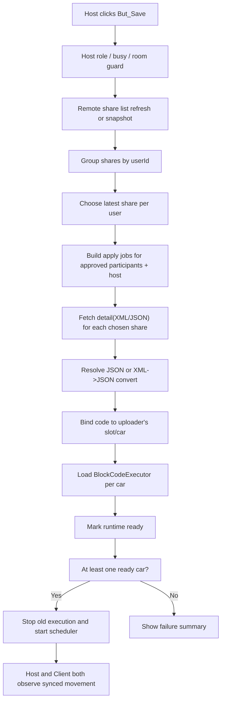

# RCCarSyncPlan

## 0. Status
- 작성일: 2026-04-28
- 대상 씬: `03_NetworkCarTest`
- 범위:
  - Host가 `Save` 버튼을 눌렀을 때
  - Host/Client가 현재 방에 업로드한 XML/JSON을
  - 업로더 본인 RC카에 매핑하고
  - 적용 완료 후 RC카가 실제로 움직이도록 만드는 작업
- 이번 문서의 성격:
  - 코드 수정 문서가 아니라 구현 방향과 정책을 고정하는 상세 계획 문서
- 비목표:
  - 이번 턴에서 코드 작성
  - 물리 엔진 전면 교체
  - Photon 권한 모델 전체 재설계

## 1. 요구사항 해석

이번 요구사항은 아래처럼 해석하는 것이 현재 코드 구조와 가장 잘 맞는다.

1. `But_Update`는 계속 "내 로컬 XML/JSON 업로드"만 담당한다.
2. `But_Save`는 Host만 누를 수 있다.
3. Host가 `But_Save`를 누르면 현재 방에 올라온 업로드 목록을 기준으로 Host/Client 각 사용자별 최신 코드 1개를 찾는다.
4. 각 코드는 "업로드한 사람의 RC카"에 적용된다.
5. 적용이 끝나면 RC카가 실제로 움직여야 한다.
6. Host와 Client는 같은 방에서 같은 차량 움직임을 본다.

중요한 해석:

- 여기서 "각자한테 적용"은 1차적으로 "업로더 `userId` 기준으로 같은 사용자의 슬롯/차량에 바인딩"을 의미한다.
- 현재 `NetworkRCCar` 구조상 실제 실행 권한은 Host state authority 쪽에 있으므로, 1차 구현은 "Host가 각 사용자 코드를 각 사용자 차량에 적용하고, 그 결과를 네트워크로 동기화"하는 방식이 가장 안전하다.
- 즉, Client 로컬에서 별도 `VirtualCarPhysics`/`BlockCodeExecutor`를 돌리는 것이 1차 목표는 아니다.

## 2. 현재 코드 기준선

### 2.1 업로드 경로

현재 로컬 파일 업로드 경로는 이미 비교적 분리되어 있다.

- `Assets/Scripts/ChatRoom/BlockShare/Client/LocalBlockCodeListPanel.cs`
  - 로컬 XML/JSON 목록 표시
  - 사용자 선택 상태 관리
- `Assets/Scripts/ChatRoom/BlockShare/Client/BlockShareUploadFlowCoordinator.cs`
  - 선택된 로컬 파일을 업로드
  - 업로드 성공 시 원격 리스트 새로고침
- `Assets/Scripts/ChatRoom/BlockShare/Shared/Infrastructure/BE2LocalBlockCodeRepository.cs`
  - `BE2_CodeStorageManager` 기반 로컬 파일 목록/`UserLevelSeq` 확보

정리하면 현재 `Update`는 이미 "로컬 선택 -> 업로드" 책임으로 나뉘어 있다.

### 2.2 원격 공유 리스트 경로

현재 원격 업로드 목록은 아래 구조다.

- `Assets/Scripts/ChatRoom/BlockShare/Remote/BlockShareRemoteListController.cs`
  - 서버 공유 목록 fetch/polling
- `Assets/Scripts/ChatRoom/BlockShare/Remote/BlockShareRemoteListPanel.cs`
  - 원격 리스트 렌더링
  - 현재는 단일 선택 모델
- `Assets/Scripts/ChatRoom/BlockShare/Shared/Models/BlockShareListItemViewModel.cs`
  - 현재 리스트 메타데이터:
    - `ShareId`
    - `RoomId`
    - `UserId`
    - `UserLevelSeq`
    - `FileName`
    - `CreatedAtUtc`

즉, "사용자별 최신 업로드 1개 선택"에 필요한 최소 정보는 이미 있다.

### 2.3 현재 Save 버튼 실제 동작

현재 `Save` 버튼은 이름과 달리 "선택한 원격 share 1개를 현재 Host에게 직접 적용"하는 흐름이다.

관련 파일:

- `Assets/Scripts/ChatRoom/BlockShare/Remote/BlockShareSaveToMyLevelButton.cs`

현재 동작:

1. 원격 리스트의 `SelectedShareId` 1개를 읽는다.
2. `FetchBlockShareDetail(...)`로 상세(XML/JSON)를 가져온다.
3. `HostNetworkCarCoordinator.ApplyRemoteBlockShareToCurrentHostAsync(...)`를 호출한다.

현재 Save 흐름의 핵심 특징:

- 단일 선택 기반이다.
- "업로더 차량"이 아니라 "현재 Host 차량"에 강제 적용한다.
- 현재 경로는 사실상 `save-to-my-level API`보다 "detail 직접 적용"에 더 가깝다.

즉, 요구사항과 가장 크게 충돌하는 지점이 여기다.

### 2.4 현재 Host runtime 적용/실행 경로

현재 Host 쪽 차량 실행 기반은 이미 존재한다.

- `Assets/Scripts/NetworkCar/HostNetworkCarCoordinator.cs`
  - 참가자 슬롯 생성
  - 차량 생성
  - 코드 바인딩
  - 런타임 적용
- `Assets/Scripts/NetworkCar/HostCarBindingStore.cs`
  - `userId -> slot -> code/runtime refs` 저장
- `Assets/Scripts/NetworkCar/HostBlockCodeResolver.cs`
  - `savedSeq` 또는 상세 XML/JSON으로부터 JSON 해석
- `Assets/Scripts/NetworkCar/HostRuntimeBinder.cs`
  - `BlockCodeExecutor.LoadProgramFromJson(...)` 호출
- `Assets/Scripts/NetworkCar/HostExecutionScheduler.cs`
  - 슬롯별 차량 순차 실행

중요한 차이:

- `HandlePhotonCodeSelection(...)` 경로는 이미 `업로더 userId` 기준으로 매핑한다.
- 반면 `HandleBlockShareSaveSucceededAsync(...)`와 `ApplyRemoteBlockShareToCurrentHostAsync(...)`는 현재 Host `userId`에 강제 적용한다.

즉, 현재 코드에는

- "업로더 기준 매핑" 경로도 있고
- "현재 Host 기준 강제 적용" 경로도 같이 존재한다.

이번 작업은 Save 버튼이 후자가 아니라 전자로 가도록 정리하는 작업이다.

### 2.5 네트워크 권한 모델

`Assets/Scripts/NetworkCar/NetworkRCCar.cs` 기준으로 현재 구조는 명확하다.

- `Object.HasStateAuthority`인 쪽만
  - `VirtualCarPhysics`
  - `BlockCodeExecutor`
  - `VirtualArduinoMicro`
  를 활성화한다.
- 비권한 쪽(Client 렌더러)은 transform/color/userId/map 상태만 네트워크로 받는다.

따라서 1차 구현에서 가장 안전한 목표는 아래다.

- Host가 각 사용자 차량에 코드를 적용한다.
- Host가 실제 차량을 움직인다.
- Client는 네트워크 동기화된 결과를 본다.

## 3. 현재 구조와 새 요구사항의 충돌

### 3.1 적용 대상이 잘못되어 있다

현재 `Save`는 선택한 share를 업로더에게 적용하지 않고 Host 자신에게 적용한다.

이 상태에서는

- Host가 올린 파일
- Client가 올린 파일

둘 다 Host 차량으로 몰릴 수 있다.

### 3.2 단일 선택 기반이라 일괄 적용 요구를 만족하지 못한다

현재 `BlockShareRemoteListPanel`은 단일 `SelectedShareId` 기반이다.

하지만 새 요구사항은 사실상 아래와 같다.

- 방에 있는 사용자 여러 명의 최신 업로드를
- 한 번의 Save로
- 각 사용자 차량에 매핑

즉, `selected share 1개` 모델로는 부족하다.

### 3.3 Save 버튼 이름과 실제 동작이 어긋나 있다

현재 버튼 이름은 `SaveToMyLevel`이지만, 실제 경로는

- detail fetch
- direct apply-to-host

중심이다.

이번 요구사항에서는 이 차이를 문서에서 먼저 인정해야 한다.

선택지:

1. Save 버튼 의미를 "방 전체 코드 적용 및 주행 시작"으로 재정의한다.
2. 서버 `save-to-my-level` 의미를 유지해야 한다면, 그 동작을 내부 단계로 숨기고 최종 UX는 여전히 "적용 + 주행"으로 보이게 한다.

### 3.4 Save 이후 자동 주행 연결이 부족하다

현재 구조는

- 코드 적용
- 실행 시작

이 분리되어 있다.

사용자 요구는 "Save 버튼 누르면 적용되고 움직여야 한다"이므로, Save가 `HostExecutionScheduler.StartExecution()`까지 이어져야 한다.

### 3.5 Client 로컬 실행 요구로 오해하면 범위가 급격히 커진다

문장을 잘못 해석해서

- Host는 Host PC에서 실행
- Client는 Client PC에서 별도 실행

으로 가면, `NetworkRCCar` 권한 모델 자체를 재설계해야 한다.

현재 구조상 1차 구현은 그렇게 가지 않는 것이 맞다.

## 4. 권장 최종 방향

### 4.1 1차 최종 정책

권장 정책은 아래다.

1. `Save`는 Host only 유지
2. `Save`는 단일 선택 적용이 아니라 "현재 방 사용자별 최신 업로드 일괄 적용"으로 의미를 바꾼다
3. 적용 타깃은 `현재 Host`가 아니라 `업로더 userId에 해당하는 차량`이다
4. 실제 물리/블록 실행은 Host authoritative 유지
5. 적용 성공 후 `Run`을 자동 시작한다

이 방식의 장점:

- 현재 `NetworkRCCar` 권한 모델과 충돌이 적다
- Host/Client 모두 결과를 같은 화면에서 본다
- "각자한테 적용" 요구를 userId 매핑으로 충족할 수 있다

### 4.2 Save 버튼의 새 의미

새 의미:

`Save = 현재 방의 최신 업로드 스냅샷을 읽고, 업로더별 자기 차량에 적용한 뒤, 실행을 시작한다`

즉, 지금의 `Apply-to-host` 개념을 버리고 아래로 바뀐다.

- `Apply-room-latest-to-owner-cars-and-run`

### 4.3 Run 버튼과의 관계

권장 정책:

- `Save`:
  - 최신 업로드 스냅샷 확보
  - 각 차량에 런타임 적용
  - 성공한 차량 기준으로 자동 실행 시작
- `Run`:
  - 이미 적용된 최신 런타임을 다시 실행

즉, `Save`는 "적용 + 시작", `Run`은 "재실행"으로 역할을 분리하는 것이 가장 명확하다.

## 5. 권장 상세 플로우



### 5.1 Save 시작 전 가드

Host가 Save를 누르면 먼저 아래를 검사한다.

- 현재 사용자가 Host인가
- 현재 방의 `ApiRoomId`가 있는가
- `ChatRoomManager`가 busy 상태인가
- 승인된 참여자 슬롯 목록이 확보되어 있는가

Host 자신의 슬롯은 승인 요청이 없더라도 반드시 준비되어 있어야 한다.

### 5.2 원격 리스트 스냅샷 확보

Save 시점에는 현재 리스트 UI 상태를 그대로 신뢰하지 말고, 한 번 더 최신 스냅샷을 확보하는 것이 안전하다.

이유:

- 방금 Client가 업로드했을 수 있다
- polling 주기와 Save 클릭 타이밍이 어긋날 수 있다
- 리스트 선택 상태는 전체 적용 요구와 맞지 않는다

권장:

- Save 클릭 시 1회 refresh
- refresh 성공 결과를 immutable snapshot으로 잡고 그 snapshot 기준으로 apply batch 진행

### 5.3 최신 업로드 선택 규칙

사용자별 최신 업로드 1개를 고르는 규칙을 문서에서 고정해야 한다.

권장 규칙:

1. 같은 `userId`끼리 그룹화
2. `CreatedAtUtc` 내림차순 우선
3. `CreatedAtUtc`가 비어 있으면 리스트 수신 순서상 마지막 항목 우선
4. 그래도 동률이면 `ShareId`가 마지막으로 관측된 항목 우선

이 규칙이면 Host와 Client가 "어떤 코드가 최신인지"를 다르게 해석하는 문제를 줄일 수 있다.

### 5.4 적용 대상 사용자 집합

Save가 적용할 대상은 아래다.

- Host 본인
- 현재 방에서 승인되어 슬롯이 생성된 Client

즉, 업로드는 했지만 아직 방 참가/승인이 안 된 사용자는 적용 대상에서 제외한다.

이유:

- 차량 슬롯이 없으면 적용 대상이 될 수 없다
- "업로드 존재"와 "현재 시뮬레이션 참가자"는 같은 개념이 아니다

### 5.5 상세 payload 확보

각 사용자별로 선택된 최신 share에 대해 아래를 수행한다.

1. `shareId`로 detail fetch
2. JSON이 있으면 JSON 사용
3. JSON이 없고 XML만 있으면 `BE2XmlToRuntimeJson.ExportToString(...)` 변환
4. 둘 다 없으면 실패 처리

이 단계는 현재 `HostBlockCodeResolver.ResolveFromBlockShareDetail(...)` 책임과 잘 맞는다.

### 5.6 차량 바인딩 규칙

핵심 규칙:

- `selectedShare.UserId == targetBinding.UserId`

즉, Host가 Save를 눌렀더라도

- Host가 올린 share는 Host 차량으로
- Client A가 올린 share는 Client A 차량으로
- Client B가 올린 share는 Client B 차량으로

가야 한다.

절대로 아래처럼 가면 안 된다.

- 선택된 모든 share를 Host 차량 하나에 적용

### 5.7 적용 성공 후 실행 시작

배치 적용이 끝나면 아래 정책을 권장한다.

1. 기존 실행이 돌고 있으면 먼저 정지
2. 이번 Save에서 `RuntimeReady == true`인 차량이 1대 이상이면 자동 실행 시작
3. 준비된 차량만 순차 실행
4. 준비 안 된 차량은 skip + 상태 패널에 이유 기록

이렇게 해야 Save 1회가 사용자 기대와 직접 연결된다.

## 6. Save 버튼의 구현 의미 재정의

### 6.1 기존 의미

- 원격 리스트에서 1개 선택
- 해당 share detail fetch
- 현재 Host 차량에 직접 적용

### 6.2 새 의미

- 현재 방 전체 업로드 스냅샷 확정
- 사용자별 최신 share 추출
- 각 share를 해당 업로더 차량에 적용
- 적용 완료 후 실행 시작

### 6.3 UI 표기 권장

버튼 내부 로직이 바뀌면 텍스트도 아래처럼 맞추는 것이 좋다.

- 유지안: `Save`
- 권장안: `Save & Run`
- 디버그용 설명 text:
  - `Apply latest uploaded code to each participant car and start`

문서 기준 권장안은 `Save & Run`이지만, 실제 버튼 라벨은 추후 UI 결정에 따라 유지해도 된다.

## 7. 권장 책임 분리

### 7.1 `BlockShareSaveToMyLevelButton`

새 책임:

- Host 전용 버튼 가드
- Save batch 시작 요청
- 진행 상태/결과 상태 표시

제거하거나 축소할 책임:

- 단일 `SelectedShareId` 의존
- `ApplyRemoteBlockShareToCurrentHostAsync(...)` 직접 호출
- "현재 Host에게만 적용" 전제

### 7.2 `BlockShareRemoteListController`

유지 책임:

- 원격 리스트 refresh/polling

추가로 필요한 책임:

- Save 시점 snapshot 제공
- 사용자별 최신 share를 고를 수 있는 원본 item 접근 제공

### 7.3 `HostNetworkCarCoordinator`

새 중심 책임:

- `current host` 기준이 아니라 `owner userId` 기준으로 코드 적용
- 사용자별 batch apply orchestration
- 적용 완료 후 실행 시작 제어

현재 구조에서 재사용 가능한 것:

- 슬롯 관리
- 차량 생성
- 런타임 바인딩
- 상태 패널 갱신

바뀌어야 하는 것:

- `ApplyRemoteBlockShareToCurrentHostAsync(...)` 성격
- `HandleBlockShareSaveSucceededAsync(...)`의 강제 Host 바인딩 전제

### 7.4 `HostExecutionScheduler`

유지 책임:

- 슬롯별 순차 실행

추가 정책:

- Save batch 완료 직후 자동 시작 진입점 제공
- Save 재시도 시 이전 실행 clean stop 후 restart

## 8. 데이터 모델 권장안

문서 기준으로 아래 중간 모델을 잡는 것이 좋다.

```csharp
sealed class ParticipantLatestShare
{
    public string UserId;
    public int SlotIndex;
    public string ShareId;
    public int UserLevelSeq;
    public string FileName;
    public string CreatedAtUtc;
}

sealed class ParticipantApplyResult
{
    public string UserId;
    public int SlotIndex;
    public string ShareId;
    public bool Applied;
    public bool RuntimeReady;
    public string Error;
}
```

핵심은 Save 버튼이 이제 "선택된 share 1개"가 아니라 "participant apply batch"를 다뤄야 한다는 점이다.

## 9. 실패 처리 정책

### 9.1 전체 실패보다 부분 성공 허용

권장:

- 한 사용자 적용 실패가 전체 Save를 즉시 중단시키지 않게 한다
- 가능한 사용자 차량은 계속 적용한다
- 마지막에 summary를 보여준다

예시:

- Host 성공, Client A 성공, Client B detail fetch 실패
- 결과:
  - Host/Client A는 주행 시작
  - Client B는 skip
  - 상태 패널에 실패 사유 기록

### 9.2 대표 실패 유형

- 해당 사용자의 최신 업로드 없음
- `shareId`는 있으나 detail fetch 실패
- JSON/XML 둘 다 비어 있음
- XML -> JSON 변환 실패
- 차량 슬롯 없음
- runtime refs 없음
- `LoadProgramFromJson(...)` 실패

### 9.3 사용자별 상태 표준화 권장

권장 상태:

- `Applied`
- `NoUpload`
- `DetailFetchFailed`
- `ResolveFailed`
- `RuntimeMissing`
- `LoadFailed`
- `Running`
- `Skipped`

## 10. 단계별 구현 계획

### Phase A. Save 의미 재정의

- `Save`를 더 이상 "selected share -> current host apply"로 보지 않는다.
- 문서/이름/상태 메시지를 "room batch apply" 기준으로 정리한다.

### Phase B. 최신 업로드 스냅샷 확정

- 원격 리스트 snapshot 확보
- `userId` 기준 그룹화
- `CreatedAtUtc` 기준 최신 share 선택

### Phase C. owner 기준 적용

- 적용 타깃을 `ResolveCurrentHostUserId()`가 아니라 `share.UserId`로 바꾼다.
- Host 슬롯/Client 슬롯 각각에 올바른 런타임 바인딩이 가도록 한다.

### Phase D. Save 후 자동 주행

- Save batch 성공 후 scheduler 자동 시작
- 기존 실행이 있으면 stop -> apply -> start 순서 보장

### Phase E. 상태 패널/요약 정리

- 총 대상 사용자 수
- 적용 성공 수
- 적용 실패 수
- 현재 실행 중 슬롯
- 마지막 오류

### Phase F. 회귀 검증

- Host 1명만 있는 방
- Host + Client 1명
- Host + Client 여러 명
- 일부 사용자 미업로드
- 같은 사용자가 여러 번 업로드

## 11. 수용 기준

아래가 되면 이번 요구사항은 충족된 것으로 본다.

1. Host와 Client가 각자 다른 XML/JSON 파일을 업로드할 수 있다.
2. Host가 `Save` 버튼을 한 번 누르면 사용자별 최신 업로드가 선택된다.
3. Host 업로드는 Host 차량에 적용된다.
4. Client 업로드는 해당 Client 차량에 적용된다.
5. 적용 완료 후 RC카가 실제로 움직인다.
6. Client 화면에서도 같은 차량 움직임이 보인다.
7. 업로드만 하고 `Save`를 누르지 않으면 차량은 자동으로 움직이지 않는다.
8. 일부 사용자 적용 실패가 있더라도 성공한 차량은 계속 실행될 수 있다.
9. 상태 패널에서 누구의 적용이 성공/실패했는지 확인할 수 있다.

## 12. 반드시 피해야 할 구현

아래 구현은 이번 요구사항 기준으로 잘못된 방향이다.

1. Save 버튼이 여전히 `SelectedShareId` 1개에만 의존하는 구현
2. Save 버튼이 여전히 모든 코드를 Host 차량에만 적용하는 구현
3. Update 버튼이 업로드와 적용을 동시에 해버리는 구현
4. Client 로컬에서 별도 물리를 돌리도록 권한 모델을 바로 뒤집는 구현
5. 한 사용자 실패 시 전체 Save를 중단해 아무 차량도 안 움직이게 만드는 구현

## 13. 열린 질문

### 13.1 서버 `save-to-my-level` API를 이번 플로우에 꼭 포함할 것인가

현재 코드 기준으로는 detail 직접 적용이 이미 가능하다.

따라서 선택지는 둘이다.

- 선택지 A. 런타임 우선
  - detail fetch -> owner 차량 적용 -> 실행
  - 서버 save는 생략
- 선택지 B. 서버 기록 우선
  - share별 `save-to-my-level` 수행
  - 저장 결과 검증
  - 그 뒤 owner 차량 적용 -> 실행

권장:

- 1차는 A
- 서버 감사/저장 이력이 꼭 필요하면 B를 2차로 추가

이유:

- 지금 요구사항의 본질은 "자기 차량에 적용하고 움직이기"다
- 현재 버튼 경로도 이미 direct apply 중심이다

### 13.2 Save 대상은 승인된 참가자만인가, 원격 리스트의 모든 사용자 업로드인가

권장 답:

- 승인되어 실제 슬롯이 있는 사용자만 대상

### 13.3 Save 시 최신 업로드가 없는 사용자는 어떻게 할 것인가

권장 답:

- 기존 코드 유지
- 상태만 `NoUpload`로 표기

## 14. 최종 결론

현재 프로젝트는 이미

- 로컬 업로드 경로
- 원격 리스트 경로
- Host 차량/슬롯/런타임 적용 경로
- 순차 실행 경로

를 각각 가지고 있다.

문제의 핵심은 기능이 없는 것이 아니라, `Save` 버튼 경로가 아직도

- 단일 선택 기반이고
- 현재 Host에게만 적용하는 흐름

으로 묶여 있다는 점이다.

따라서 이번 작업의 본질은 "새 시스템을 처음부터 만드는 것"이 아니라 아래 3가지를 맞추는 것이다.

1. Save 대상을 `current host`가 아니라 `share owner`로 바꾼다.
2. Save 단위를 `selected share 1개`가 아니라 `room latest share per participant`로 바꾼다.
3. Save 결과가 바로 RC카 주행으로 이어지게 한다.

이 방향으로 가면 현재 Host authoritative 구조를 유지하면서도, 사용자가 원하는

- Host가 Save를 누르고
- Host/Client가 올린 XML/JSON이
- 각자 차량에 적용되고
- RC카가 움직이는 흐름

을 가장 낮은 리스크로 만들 수 있다.
