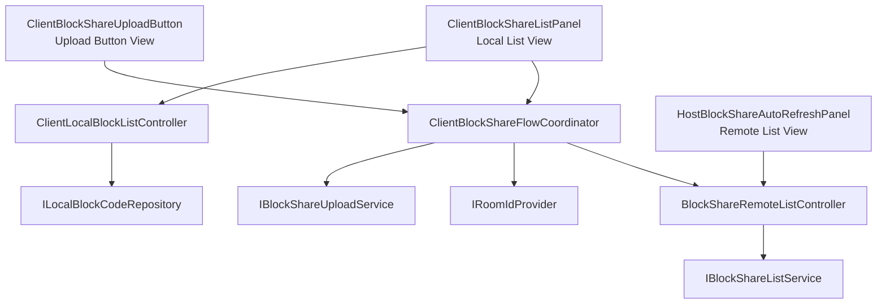

# ReShareUIIPlan

## 0. Status
- 작성일: 2026-04-27
- 대상 Scene: `03_NetworkCarTest`
- 대상 클래스:
  - `Assets/Scripts/ChatRoom/ClientBlockShareListPanel.cs`
  - `Assets/Scripts/ChatRoom/ClientBlockShareUploadButton.cs`
  - `Assets/Scripts/ChatRoom/HostBlockShareAutoRefreshPanel.cs`
- 목표:
  - Client는 로컬 XML/JSON 파일 선택과 업로드만 담당한다.
  - Client는 서버 업로드 결과를 `List Scroll View`에서 확인만 할 수 있다.
  - Block share 흐름에서 legacy GUI/IMGUI를 더 이상 사용하지 않는다.
  - 불필요한 verify/detail/debug UI 결합을 제거하고, SOLID 원칙에 맞게 책임을 분리한다.
- 비목표:
  - `ChatRoomManager`의 네트워크 API 계약 자체를 바꾸는 작업
  - Host save-to-my-level 전체 흐름 재설계
  - 다른 네트워크 UI 전체 재구성

## 1. 요구사항 요약
1. Client는 로컬 파일 목록을 보고 XML/JSON 파일을 선택할 수 있어야 한다.
2. Client는 선택한 파일을 업로드할 수 있어야 한다.
3. Client는 업로드가 잘 되었는지 서버 리스트 스크롤뷰에서 파일명을 확인할 수 있어야 한다.
4. Client 전용으로만 존재하던 불필요한 UI는 제거한다.
5. GUI/IMGUI 기반 처리(`OnGUI`, `GUI`, `GUILayout`)는 block share 흐름에서 사용하지 않는다.
6. 사용하지 않는 코드와 인스펙터 `None` 필드에 의존하는 코드는 남기지 않는다.

## 2. 현재 구조의 문제

### 2.1 `ClientBlockShareListPanel`
- 로컬 파일 목록 표시
- 파일 선택 상태 관리
- 패널 열기/닫기
- 버튼 바인딩
- 업로드 요청 실행
- room id 해석
- userLevelSeq 추론

위 책임이 한 클래스에 모두 몰려 있다.  
즉, View + Controller + Upload Orchestrator + Selection State가 하나로 합쳐져 있다.

### 2.2 `ClientBlockShareUploadButton`
- 버튼 바인딩
- 입력 필드 파싱
- room id 해석
- `ChatRoomManager` 이벤트 구독
- 업로드 진행 상태 관리
- 업로드 성공/실패 후처리

현재는 "버튼 컴포넌트"가 아니라 사실상 "업로드 서비스 + 컨트롤러"에 가깝다.

### 2.3 `HostBlockShareAutoRefreshPanel`
- 서버 리스트 fetch
- polling
- detail fetch
- host 여부 판단
- 리스트 UI 렌더링
- 선택 상태 관리
- 상태 텍스트/상세 텍스트 갱신

이 클래스는 이름은 panel이지만 실제로는 View + Query Controller + Polling Controller + Host Policy를 동시에 가진다.

### 2.4 구조적 문제 정리
- SRP 위반: 각 클래스가 한 가지 이유가 아니라 여러 이유로 변경된다.
- OCP 위반: Client/Host 정책이 UI 클래스 내부 분기문으로 박혀 있다.
- ISP 위반: 버튼 컴포넌트가 필요 없는 입력 필드, 이벤트, 네트워크 세부사항까지 안다.
- DIP 위반: UI가 `ChatRoomManager`, `BE2_CodeStorageManager`, room resolver에 직접 결합되어 있다.

## 3. 목표 UX

### 3.1 Client UX
1. Client가 로컬 파일 리스트 패널을 연다.
2. XML/JSON 파일 하나를 선택한다.
3. 업로드 버튼을 누른다.
4. 업로드 요청이 실행된다.
5. 서버 업로드 리스트가 갱신된다.
6. Client는 스크롤뷰에서 방금 올린 파일명을 확인한다.

### 3.2 Host UX
- Host도 같은 서버 업로드 리스트를 볼 수 있다.
- Host 전용 save 기능이 필요하다면, 원격 리스트의 "선택된 share id"만 재사용한다.
- 업로드 리스트 조회 기능 자체는 Host 전용이 아니어야 한다.

## 4. 리팩토링 원칙

### 4.1 SRP
- 리스트를 보여주는 클래스는 리스트만 보여준다.
- 업로드를 실행하는 클래스는 업로드만 실행한다.
- 서버 리스트를 가져오는 클래스는 fetch/polling만 담당한다.

### 4.2 OCP
- Host/Client 차이는 정책 클래스로 분리하고, view class 내부 `if (_hostOnly)` 분기를 줄인다.

### 4.3 LSP
- 로컬 파일 공급자, 업로드 서비스, 서버 리스트 서비스는 인터페이스로 추상화한다.
- 이후 `BE2_CodeStorageManager`가 아닌 다른 저장소가 와도 UI는 바뀌지 않아야 한다.

### 4.4 ISP
- 로컬 파일 조회 인터페이스
- 업로드 인터페이스
- 서버 리스트 조회 인터페이스
- room id 제공 인터페이스

작은 인터페이스로 나누고, 각 소비자는 자기에게 필요한 것만 의존한다.

### 4.5 DIP
- `MonoBehaviour` view는 구체 서비스가 아니라 인터페이스/코디네이터에만 의존한다.
- `ChatRoomManager` 직접 호출은 infrastructure service 한 곳으로 모은다.

## 5. 추천 구조

### 5.1 디렉터리 구조
```text
Assets/Scripts/ChatRoom/BlockShare/
  Shared/
    Models/
      LocalBlockCodeEntry.cs
      BlockShareUploadRequest.cs
      BlockShareUploadResult.cs
      BlockShareListItemViewModel.cs
    Contracts/
      ILocalBlockCodeRepository.cs
      IBlockShareUploadService.cs
      IBlockShareListService.cs
      IRoomIdProvider.cs
      IUserLevelSeqResolver.cs
    Infrastructure/
      BE2LocalBlockCodeRepository.cs
      ChatRoomBlockShareUploadService.cs
      ChatRoomBlockShareListService.cs
      FusionRoomIdProvider.cs
      FileNameUserLevelSeqResolver.cs
  Client/
    ClientBlockShareFlowCoordinator.cs
    ClientLocalBlockListController.cs
  Remote/
    BlockShareRemoteListController.cs
```

### 5.2 기존 클래스 유지 전략
- 1차 리팩토링에서는 Unity scene/prefab 참조 안정성을 위해 기존 파일/class 이름을 유지한다.
- 내부 책임만 줄인다.
- 2차 정리에서만 이름을 바꾼다.

즉:
- `ClientBlockShareListPanel`은 이름은 유지, 역할은 Local File List View로 축소
- `ClientBlockShareUploadButton`은 이름은 유지, 역할은 Upload Button View로 축소
- `HostBlockShareAutoRefreshPanel`은 이름은 유지, 역할은 Remote Share List View로 축소
- 장기적으로 `HostBlockShareAutoRefreshPanel`은 `BlockShareRemoteListPanel`로 rename

## 6. 클래스별 목표 책임

### 6.1 `ClientBlockShareListPanel`
역할:
- 로컬 파일 리스트 UI 표시
- 로컬 파일 선택 상태 관리
- 선택된 파일 정보 노출
- refresh 버튼 / close 버튼 등 순수 UI 이벤트 발생

가져야 할 기능:
- `RenderLocalFiles(IReadOnlyList<BlockShareListItemViewModel> items)`
- `TryGetSelectedEntry(out LocalBlockCodeEntry entry)`
- `SetBusy(bool isBusy)`
- `OpenPanel()`
- `ClosePanel()`
- `OnRefreshRequested` 이벤트
- `OnSelectionChanged` 이벤트

가지면 안 되는 기능:
- `ChatRoomManager.UploadBlockShare(...)` 직접 호출
- room id 해석
- token 처리
- 업로드 성공/실패 이벤트 구독
- host/client 역할 정책
- button ownership guard

정리 대상 코드:
- `_uploadButtonTarget`
- `TrySendSelectedCodeByApi(...)`
- `SendSelectedToHost()`
- `ResolveTargetRoomId()`
- 업로드 실행을 위한 button ownership 관련 코드
- `OpenGui`, `CloseGui`, `ToggleGuiVisibility` 같은 legacy 이름

이 클래스는 최종적으로 "로컬 파일 리스트를 보여주는 view"여야 한다.

### 6.2 `ClientBlockShareUploadButton`
역할:
- 업로드 버튼 클릭 이벤트만 외부에 전달
- busy 상태에 따라 interactable만 변경

가져야 할 기능:
- `OnUploadClicked` 이벤트
- `SetInteractable(bool interactable)`
- `SetBusy(bool isBusy)`

가지면 안 되는 기능:
- `ChatRoomManager` 이벤트 구독
- room id 해석
- input field 파싱
- upload request DTO 생성
- 업로드 결과 판단
- `ApplyDraft(...)`

정리 대상 코드:
- `_userLevelSeqInput`
- `_messageInput`
- `_tokenOverrideInput`
- `ApplyDraft(...)`
- `TryBindManagerEvents()`
- `HandleBlockShareUploadSucceeded(...)`
- `HandleBlockShareUploadFailed(...)`
- `HandleBlockShareUploadCanceled(...)`
- `ResolveTargetRoomId()`
- `ResolveMessage()`
- `ResolveTokenOverride()`

이 클래스는 최종적으로 "업로드 버튼 view adapter"여야 한다.

### 6.3 `HostBlockShareAutoRefreshPanel`
역할:
- 서버 block share 리스트를 스크롤 뷰에 렌더링
- 선택 상태 유지
- empty state / loading state / refresh 버튼 처리

가져야 할 기능:
- `RenderRemoteShares(IReadOnlyList<BlockShareListItemViewModel> items)`
- `TryGetSelectedShareId(out string shareId)`
- `SetBusy(bool isBusy)`
- `SetEmpty(bool isEmpty)`
- `OnRefreshRequested` 이벤트

선택 유지 정책:
- 단일 선택만 유지한다.
- 다중 체크 기반 batch save가 필요 없다면 `TryGetCheckedShareIds(...)`는 제거한다.

가지면 안 되는 기능:
- host-only 정책 판단
- detail fetch
- detail text 갱신
- save-to-my-level 실행
- `ChatRoomManager` 직접 구독
- polling coroutine 직접 소유

정리 대상 코드:
- `_hostOnly`
- `_fetchDetailWhenSelected`
- `_refreshDetailAfterListUpdate`
- `_detailText`
- `RequestSelectedDetailNow()`
- detail fetch 이벤트 handler 전부
- `_knownShareIds`가 save 검증용으로 쓰이는 결합

이 클래스는 최종적으로 "원격 업로드 리스트 view"여야 한다.

## 7. 새로 추가할 클래스

### 7.1 `ClientBlockShareFlowCoordinator`
위치:
- `Assets/Scripts/ChatRoom/BlockShare/Client/ClientBlockShareFlowCoordinator.cs`

역할:
- `ClientBlockShareListPanel`
- `ClientBlockShareUploadButton`
- `BlockShareRemoteListController`

세 컴포넌트를 연결하는 application coordinator

기능:
- 업로드 버튼 클릭 시 현재 선택된 로컬 파일을 조회
- 업로드 가능 여부 검증
- 업로드 서비스 호출
- 업로드 중 UI busy 처리
- 업로드 성공 후 원격 리스트 refresh 요청

이 클래스가 가져야 할 의존성:
- `ILocalBlockCodeRepository`
- `IBlockShareUploadService`
- `IRoomIdProvider`
- `IUserLevelSeqResolver`

### 7.2 `ClientLocalBlockListController`
위치:
- `Assets/Scripts/ChatRoom/BlockShare/Client/ClientLocalBlockListController.cs`

역할:
- 로컬 파일 목록 로드
- 파일명/메타데이터를 view model로 변환
- `ClientBlockShareListPanel`에 렌더링 요청

기능:
- `RefreshAsync()`
- `GetCurrentEntries()`
- `ResolveSelectedEntry(...)`

이유:
- BE2 저장소 접근 코드를 view에서 제거하기 위함

### 7.3 `BlockShareRemoteListController`
위치:
- `Assets/Scripts/ChatRoom/BlockShare/Remote/BlockShareRemoteListController.cs`

역할:
- 서버 업로드 리스트 fetch
- polling 정책 관리
- 리스트 결과를 `HostBlockShareAutoRefreshPanel`에 전달

기능:
- `RefreshNowAsync()`
- `StartPolling()`
- `StopPolling()`
- `SetAutoRefresh(bool enabled)`

이유:
- polling/fetch 책임을 panel에서 제거하기 위함

### 7.4 `ILocalBlockCodeRepository` / `BE2LocalBlockCodeRepository`
위치:
- `Assets/Scripts/ChatRoom/BlockShare/Shared/Contracts/ILocalBlockCodeRepository.cs`
- `Assets/Scripts/ChatRoom/BlockShare/Shared/Infrastructure/BE2LocalBlockCodeRepository.cs`

역할:
- `BE2_CodeStorageManager` 접근을 추상화

기능:
- `Task<IReadOnlyList<LocalBlockCodeEntry>> GetEntriesAsync()`

### 7.5 `IBlockShareUploadService` / `ChatRoomBlockShareUploadService`
위치:
- `Assets/Scripts/ChatRoom/BlockShare/Shared/Contracts/IBlockShareUploadService.cs`
- `Assets/Scripts/ChatRoom/BlockShare/Shared/Infrastructure/ChatRoomBlockShareUploadService.cs`

역할:
- `ChatRoomManager.UploadBlockShare(...)` 호출과 결과 대기를 캡슐화

기능:
- `Task<BlockShareUploadResult> UploadAsync(BlockShareUploadRequest request)`

이유:
- UI가 `ChatRoomManager` 이벤트에 직접 매달리지 않게 하기 위함

### 7.6 `IBlockShareListService` / `ChatRoomBlockShareListService`
위치:
- `Assets/Scripts/ChatRoom/BlockShare/Shared/Contracts/IBlockShareListService.cs`
- `Assets/Scripts/ChatRoom/BlockShare/Shared/Infrastructure/ChatRoomBlockShareListService.cs`

역할:
- 원격 block share 리스트 fetch를 캡슐화

기능:
- `Task<IReadOnlyList<BlockShareListItemViewModel>> FetchListAsync(string roomId, int page, int size, string tokenOverride)`

### 7.7 `IRoomIdProvider` / `FusionRoomIdProvider`
역할:
- 현재 room id를 제공

이유:
- 각 UI/컨트롤러에서 `NetworkRoomIdentity.ResolveApiRoomId(...)`를 직접 호출하지 않게 하기 위함

### 7.8 `IUserLevelSeqResolver` / `FileNameUserLevelSeqResolver`
역할:
- 파일명 또는 저장 메타데이터에서 `userLevelSeq` 추론

이유:
- 현재 `ClientBlockShareListPanel` 안에 있는 정규식 파싱 책임을 분리하기 위함

## 8. 의존성 흐름



원칙:
- View는 service를 직접 호출하지 않는다.
- Controller/Coordinator가 use-case를 실행한다.
- Infrastructure만 외부 시스템(`ChatRoomManager`, `BE2_CodeStorageManager`)을 안다.

## 9. 제거/축소 대상

### 9.1 GUI/IMGUI
- `OnGUI`
- `GUI`
- `GUILayout`
- `GUIStyle`

block share 관련 흐름에서는 사용하지 않는다.

### 9.2 Client 불필요 기능
- Client가 host-only detail을 가져오는 코드
- Client가 remote share를 save 대상으로 다루는 코드
- Client 업로드 버튼에 남아 있는 token/message/manual draft 입력 기능

### 9.3 Panel naming
- `OpenGui`, `CloseGui`, `ToggleGuiVisibility`는 `OpenPanel`, `ClosePanel`, `TogglePanel`로 정리한다.
- "GUI"라는 이름은 legacy 의미만 남기므로 제거한다.

### 9.4 Host-only 결합
- `HostBlockShareAutoRefreshPanel` 내부 `_hostOnly` 분기
- detail fetch 전용 상태 텍스트
- batch save 체크리스트 기능

## 10. 구현 단계

### Phase 1. 데이터/서비스 추상화 추가
1. `LocalBlockCodeEntry`
2. `BlockShareUploadRequest`
3. `BlockShareUploadResult`
4. `ILocalBlockCodeRepository`
5. `IBlockShareUploadService`
6. `IBlockShareListService`
7. `IRoomIdProvider`
8. `IUserLevelSeqResolver`

### Phase 2. `ClientBlockShareListPanel` 축소
1. 로컬 리스트 view 역할만 남긴다.
2. 업로드 실행 코드 제거
3. room/token 관련 필드 제거
4. GUI naming 제거

### Phase 3. `ClientBlockShareUploadButton` 축소
1. button view 역할만 남긴다.
2. input field 제거
3. `ChatRoomManager` 이벤트 구독 제거
4. `ApplyDraft(...)` 제거

### Phase 4. `HostBlockShareAutoRefreshPanel` 축소
1. remote list view 역할만 남긴다.
2. detail fetch 제거
3. host-only 분기 제거
4. polling은 controller로 이동

### Phase 5. coordinator/controller 연결
1. `ClientBlockShareFlowCoordinator`
2. `ClientLocalBlockListController`
3. `BlockShareRemoteListController`

### Phase 6. dead code 제거
1. `None` 필드 의존 코드 제거
2. GUI/IMGUI 관련 코드 제거
3. ownership guard 재검토
4. 사용하지 않는 helper 제거

## 11. 테스트 기준
1. Client가 로컬 XML/JSON 파일 목록을 정상적으로 본다.
2. Client가 파일 1개를 선택할 수 있다.
3. 업로드 버튼은 선택이 없으면 비활성화된다.
4. 업로드 중에는 중복 클릭이 막힌다.
5. 업로드 성공 후 서버 리스트가 갱신된다.
6. Client가 서버 스크롤 리스트에서 업로드된 파일명을 확인할 수 있다.
7. Host도 같은 서버 리스트를 볼 수 있다.
8. block share 경로에 `OnGUI`, `GUI`, `GUILayout` 사용이 남아 있지 않다.
9. view class 내부에 `ChatRoomManager` 직접 호출이 남아 있지 않다.

## 12. 완료 기준
- `ClientBlockShareListPanel`은 로컬 리스트 view 역할만 가진다.
- `ClientBlockShareUploadButton`은 업로드 버튼 view 역할만 가진다.
- `HostBlockShareAutoRefreshPanel`은 remote list view 역할만 가진다.
- 업로드, 리스트 fetch, polling, room id resolve는 별도 controller/service로 이동한다.
- Client는 "업로드 + 서버 리스트 확인"만 수행한다.
- legacy GUI/IMGUI는 block share 흐름에서 제거된다.
- 사용하지 않는 필드/메서드/분기문이 남지 않는다.

## 13. 결론
- 이번 리팩토링의 핵심은 "Client 기능을 줄이는 것"이 아니라 "책임을 올바르게 나누는 것"이다.
- 기존 3개 클래스는 그대로 둘 수 있지만, 더 이상 orchestration 중심 클래스가 되면 안 된다.
- 최소 설계는 다음과 같다.
  - Local List View: `ClientBlockShareListPanel`
  - Upload Button View: `ClientBlockShareUploadButton`
  - Remote List View: `HostBlockShareAutoRefreshPanel`
  - Client Flow Coordinator: `ClientBlockShareFlowCoordinator`
  - Remote List Controller: `BlockShareRemoteListController`
  - Storage/Upload/List/Room resolver 서비스 계층
- 이 구조로 가면 Client는 업로드만 하고, 업로드 결과 검증은 공용 remote list에서 확인하는 단순한 흐름으로 정리된다.
